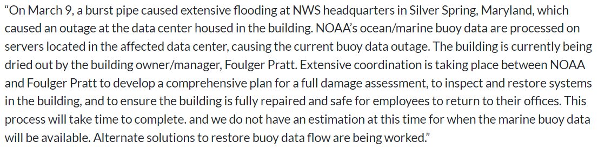
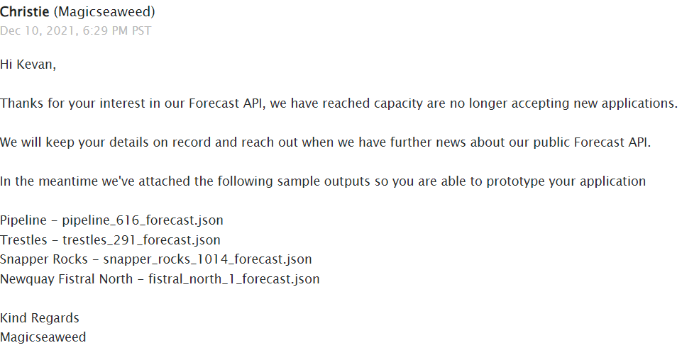

# Surf Forecaster

This was a self-directed project done through a busy semester. I had the Google Maps' API sorted and the general layout completed. When it came time to start calling the NOAA's buoy's for data, I kept getting errors.

Turns out:

And when I tried to use another surf forecasting company's data:

I ended up just randomizing the wave information so I could have a mostly finished product.
